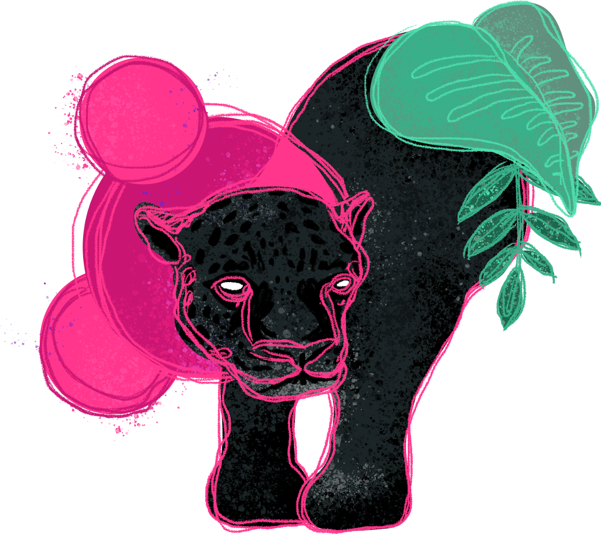

# Biblioteca de componentes do Animalia DS

<p  align="center">



</p>

Biblioteca de componentes do design system Animalia baseada em Web Components.

## Índice

- [Biblioteca de componentes do Animalia DS](#biblioteca-de-componentes-do-animalia-ds)
  - [Índice](#índice)
  - [Como usar](#como-usar)
    - [Angular](#angular)
  - [Changelog](#changelog)
  - [Navegadores suportados (Browser Support)](#navegadores-suportados-browser-support)
  - [Polyfills](#polyfills)
  - [Licença](#licença)

<a id="how-to-use"></a>

## Como usar

Instale o pacote via npm:

```
npm install @animaliads/animalia-web-components
```

Se preferir, você também pode instalar o componente de forma individual:

```
npm install @animaliads/ani-button
```

Adicione o arquivo instalado no seu código `html`:

```
<script type="module" src="./node_modules/@animaliads/button/index.js"></script>
```

<a id="angular"></a>

### Angular

Para utilizar o web component, você precisará adicionar o `CUSTOM_ELEMENTS_SCHEMA` no módulo da sua aplicação.

```
import { NgModule, CUSTOM_ELEMENTS_SCHEMA } from '@angular/core';

@NgModule({
  imports: [CommonModule],
  declarations: [PageComponent],
  exports: [PageComponent],
  schemas: [
    CUSTOM_ELEMENTS_SCHEMA
  ]
})

export class PageModule {}
```

Você também precisará importar o pacote dentro do seu componente:

```
import '@animaliads/ani-button';
```

<a id="changelog"></a>

## Changelog

Saiba mais sobre as [últimas correções e melhorias](CHANGELOG.md).

<a id="browser-support"></a>

## Navegadores suportados (Browser Support)

| Chrome   | Firefox  | Safari   | Edge     | IE   |
| -------- | -------- | -------- | -------- | ---- |
| Latest ✔ | Latest ✔ | Latest ✔ | Latest ✔ | 11\* |

\*IE 11 necessita de _polyfills_ para funcionar e não tem a funcionalidade de troca de tema.

<a id="polyfills"></a>

## Polyfills

[EM BREVE]

<a id="license"></a>

## Licença

[MIT](LICENSE)
