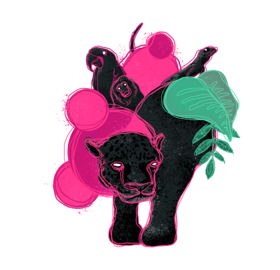

# Biblioteca de componentes do Animalia DS

<p  align="center">



</p>

Biblioteca de componentes do design system Animalia baseada em Web Components.

## Índice

- [Biblioteca de componentes do Animalia DS](#biblioteca-de-componentes-do-animalia-ds)
  - [Índice](#índice)
  - [Como usar](#como-usar)
    - [Angular](#angular)
  - [Changelog](#changelog)
  - [Navegadores suportados (Browser Support)](#navegadores-suportados-browser-support)
  - [Polyfills](#polyfills)
  - [Licença](#licença)

<a id="how-to-use"></a>

## Como usar

Instale o pacote via npm:

```
npm install @animaliads/web-components
```

Se preferir, você também pode instalar o componente de forma individual:

```
npm install @animaliads/ani-button
```

Importe o código do componente no seu módulo javascript:

```javascript
import '@animaliads/ani-button';
```

E adicione e tag do componente no seu HTML:

```html
<ani-button>Hello World</ani-button>
```

> Os pacotes do AnimaliaDS são gerados utilzando os módulos Node. Para isso,
> você precisar fazer as resolução de módulos antes de utilizar o componente.
> Veja mais no [começando do AnimaliaDS](http://animaliads.io/?path=/docs/come%C3%A7ando--page).

<a id="angular"></a>

### Angular

Para utilizar o web component, você precisará adicionar o `CUSTOM_ELEMENTS_SCHEMA` no módulo da sua aplicação.

```
import { NgModule, CUSTOM_ELEMENTS_SCHEMA } from '@angular/core';

@NgModule({
  imports: [CommonModule],
  declarations: [PageComponent],
  exports: [PageComponent],
  schemas: [
    CUSTOM_ELEMENTS_SCHEMA
  ]
})

export class PageModule {}
```

Você também precisará importar o pacote dentro do seu componente:

```
import '@animaliads/web-components';
```

<a id="changelog"></a>

## Instalação

Este projeto usa o gerenciador de pacotes NPM e a ferramenta Lerna para instalar e gerenciar suas dependências. Para começar, siga as instruções abaixo:

1. Certifique-se de ter o Node.js e o NPM instalados em sua máquina. Você pode instalá-los a partir do site oficial: [nodejs.org](https://https://nodejs.org/en/download/)

2. Abra um terminal na raiz do projeto e execute o comando:

```
npm install
```

Este comando instalará todas as dependências do projeto listadas no arquivo package.json.

3. Em seguida, instale a ferramenta Lerna globalmente usando o comando:

```
npm install -g lerna
```

4. Agora, execute o seguinte comando para inicializar o ambiente de desenvolvimento e instalar as dependências em todos os pacotes do projeto:

```
lerna bootstrap
```

5. Após a instalação das dependências, execute o seguinte comando para compilar o código:

```
lerna run buid
```

Este comando compilará o código em todos os pacotes do projeto.

6. Por fim, execute o seguinte comando para iniciar o Storybook:

```
npm run storybook
```

Este comando iniciará o Storybook em seu navegador para visualizar e testar os componentes do projeto.

Com esses passos, você terá instalado todas as dependências e configurado o ambiente de desenvolvimento para trabalhar no projeto.

### AnimaliaDS Demo

Para visualizar a versão demo do AnimaliaDS, basta rodar o comando lerna abaixo como passo 6:

```
lerna run start
```

## Changelog

Saiba mais sobre as [últimas correções e melhorias](CHANGELOG.md).

<a id="browser-support"></a>

## Navegadores suportados (Browser Support)

| Chrome   | Firefox  | Safari   | Edge     |
| -------- | -------- | -------- | -------- |
| Latest ✔ | Latest ✔ | Latest ✔ | Latest ✔ |

<a id="polyfills"></a>

## Polyfills

[EM BREVE]

<a id="license"></a>

## Licença

[MIT](LICENSE)
